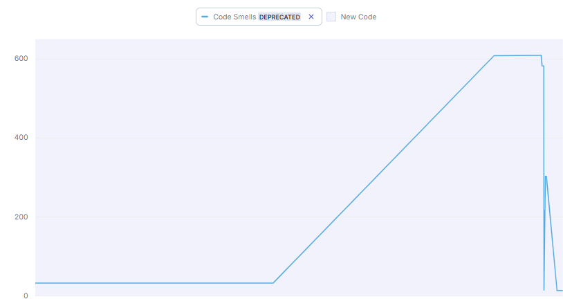

# Breakout Game

This project is a demo Breakout game built with Node.js as part of the CS455 coursework.

Code smell[](https://sonarcloud.io/summary/new_code?id=breakout-game)

Test coverage
[](https://kartik-r-soni.github.io/breakout-game-code-coverage/)

## Node Packages Used

- **ESLint**: Enforces code quality through linting with custom rules.
- **C8**: Provides test coverage reporting.
- **SonarQube**: Ensures overall code quality and highlights potential issues.
- **Mocha**: A framework for unit testing.
- **Chai**: Assertion library used for unit testing with Mocha.

## Running Code Quality Tools

### Linting
To lint the code and enforce coding standards:
```bash
npm run lint
```
### Testing
To run the unit tests:
```bash
npm run test
```
### Test coverage
To generate a test coverage report:
```bash
npm run coverage
```
### Code quality
To analyze the code with SonarQube:
```bash
npm run sonar
```
# Work Done

## Debugging
- Identified and fixed multiple issues during **BUG BASH** and testing.
- Corrected code to resolve the errors found.

## Refactoring
- Refactored the JavaScript code to a modular structure using **ECMAScript** modules.
- Introduced **ESLint** to improve code maintainability.
- Integrated **SonarQube**, addressing code smells, duplication, and security vulnerabilities.

## Testing
- Developed comprehensive **unit tests** for the entire application.
- Created a functional test for easier manual verification.

## DevOps
- Configured CI pipelines using `.yml` files to enforce quality gates:
  1. **ESLint** for code linting.
  2. **Mocha & Chai** for unit testing.
  3. **C8** for code coverage.
  4. **SonarQube** for static code analysis.
- Automated deployment to **GitHub Pages** after passing all tests.


## PS Improvements

